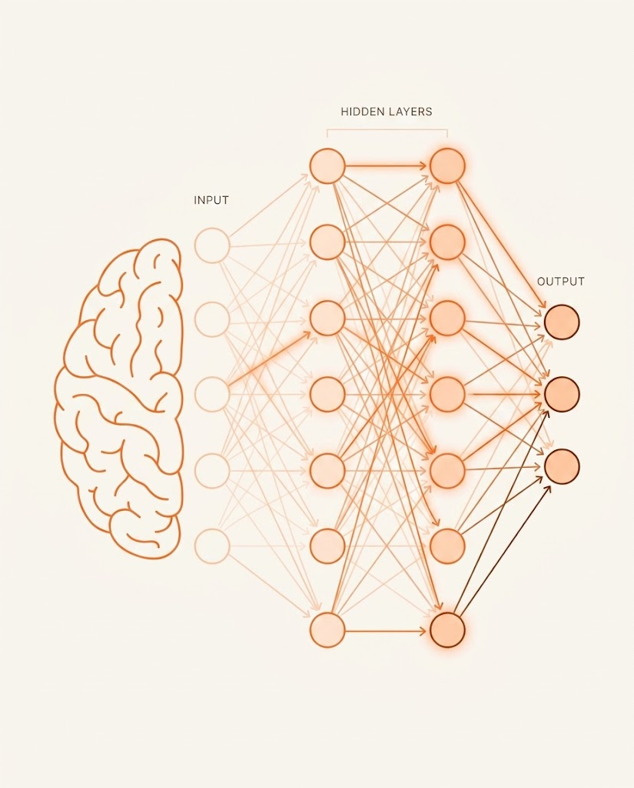

# Anotações: Fundamentos da IA Moderna: Machine Learning, LLMs, IA Generativa e Agentes

Este documento reúne minhas anotações ao longo das aulas deste curso.

---

## Aula 1: Como a Inteligência Artificial Nasceu

**Objetivo da aula:** Compreender os primórdios da IA e como seus conceitos base não são coisas que surgiram do nada na nossa geração.

### Principais pontos que anotei:

- **As origens com Alan Turing:** 
  A ideia de Inteligência Artificial já vem de muito tempo atrás. Tudo começou na década de 1950 com figuras como Alan Turing, cuja ideia inicial era basicamente criar uma "inteligência imitada". O objetivo era fazer com que as máquinas conseguissem imitar o comportamento humano de um jeito tão real que não conseguiríamos mais distinguir se estávamos falando com uma pessoa ou com um computador (o famoso Teste de Turing).

- **Evolução e o domínio das grandes corporações:**
  Por muitas décadas, a IA evoluiu em pesquisas, mas seu uso prático era extremamente custoso e restrito a gigantes da tecnologia, como a **IBM** (famosa por criar supercomputadores como o Deep Blue e o Watson). Naquela época, ter acesso e aplicar IA exigia recursos financeiros e computacionais que apenas grandes empresas e laboratórios possuíam.

- **O "boom" e a democratização com o GPT:**
  Com o barateamento do processamento e a imensa quantidade de dados gerados na internet, pesquisadores conseguiram aprimorar drasticamente as redes neurais. O verdadeiro marco de popularização ("boom") aconteceu recentemente com a chegada de Modelos de Linguagem de Grande Escala (LLMs) como o **GPT**. Eles pegaram essa tecnologia antes inacessível e colocaram nas mãos do público geral através de interfaces simples de chat.

- **IA não é uma novidade na nossa rotina:**
  Apesar do boom recente, a IA já vivia no nosso dia a dia. Um exemplo super legal que o professor deu: o autocomplete (corretor) do nosso teclado do celular. Ele já usa, em sua essência, a linguagem natural para prever qual a próxima palavra que vamos digitar.

- **Como funciona por baixo dos panos:**
  Pode parecer mágica, mas não é. O funcionamento central dessas IA focadas em texto é puramente baseado em **probabilidade**. O sistema analisa qual é a probabilidade estatística de uma palavra (ou token) aparecer depois da outra e simplesmente tenta prever a continuação, baseando-se nos oceanos de dados com os quais foi treinado. Achei isso muito interessante!

---

## Aula 2: Como uma Inteligência Artificial é treinada e o que são LLMs

**Objetivo da aula:** Desmistificar o processo de treinamento de uma IA, compreendendo como ela "aprende" a reconhecer padrões através de parâmetros e o que são os famosos Modelos de Linguagem (LLMs e SLMs).

### O Significado de "Artificial"
Se olharmos a definição de "artificial" no dicionário, significa algo produzido pela arte ou indústria humana, que não é natural, mas que imita a natureza. A Inteligência Artificial faz exatamente isso: ela não tem uma consciência natural, mas simula a inteligência humana baseando-se em regras, matemática, probabilidade e muitos dados.

### A Tangibilidade do Treinamento (O Exemplo da Maçã)
O treinamento de uma IA funciona estabelecendo padrões (parâmetros/tokens) que ela usa como um "dicionário" para comparar e decidir. O professor usou um excelente exemplo prático: ensinar a IA a detectar uma maçã.

1. **Definição Inicial:** Damos um contexto (ex: uma imagem) e dizemos que aquilo é uma maçã. Passamos características para o dicionário do modelo: formato quase esférico, pedaço de caule na parte superior, fenda superior, tons de vermelho.
2. **Inconsistências e Dúvidas:** Se mostrarmos uma maçã levemente rotacionada, a fenda muda de lugar. A IA vai analisar seus tokens e encontrar inconsistências, concluindo que a chance de ser maçã é de apenas 50%.
3. **Reforço Positivo (Feedback):** Nós damos um "empurrão" (feedback) dizendo: "Sim, isso é uma maçã". Assim, a IA enriquece seu dicionário com uma nova regra: a fenda e o caule podem estar em outras direções.
4. **Enriquecendo o Dicionário:** Mostramos uma maçã com folha, ou uma maçã mais amarelada por estar madura. A IA confronta com o formato e caule, percebe que atende à maioria dos requisitos e diz: "provavelmente é uma maçã". Nós confirmamos (reforço positivo), e ela aprende que maçãs podem ser amarelas ou ter folhas.
5. **Casos Extremos (Maçã cortada):** Ao mostrar uma maçã cortada ao meio, a cor interna e o formato mudam. A IA pesa os prós (tem caule, leve fenda) e contras (cor diferente). Pela probabilidade (ex: 4 positivos contra 1 negativo), ela deduz que é uma maçã. Com nosso feedback, ela aprende a reconhecer maçãs abertas.
6. **Rejeitando o Errado (Pera):** Ao mostrar uma pera, os critérios negativos (formato não esférico, tons mais verdes) superam os positivos. A IA julga que não é uma maçã e acerta.

**Conclusão:** A IA erra muito no começo por não ter um grande contexto. Mas, através da exposição contínua a amostras e dos reforços positivos, os parâmetros vão aumentando. Ela constrói um repertório gigantesco, tornando os resultados muito mais prováveis e precisos.

### Modelos de Linguagem (LLMs e SLMs)

Quando transportamos a ideia dos parâmetros da maçã para processar linguagem natural humana em larga escala, estamos falando de milhares e bilhões de tokens. 

- **LLM (Large Language Model - Grande Modelo de Linguagem):** São modelos treinados com bases de conhecimento massivas e bilhões de parâmetros (ex: o ChatGPT da OpenAI). Eles têm um vocabulário vasto e geral. O mercado não vive só de modelos proprietários; existe uma enorme comunidade desenvolvendo poderosos LLMs **Open Source** (código aberto).
- **SLM (Small Language Model - Pequeno Modelo de Linguagem):** São modelos menores, treinados com um vocabulário e contexto mais restritos. Com menos parâmetros, eles são mais leves e eficientes para criar um **agente treinado** focado no reconhecimento de um objeto específico ou em uma tarefa especialista, sem precisar do peso de um LLM gigantesco.

---

## Aula 3: Entendendo Deep Learning

**Objetivo da aula:** Revisar os conceitos de Inteligência Artificial e Machine Learning e aprofundar no funcionamento do Deep Learning (Aprendizado Profundo), compreendendo como as máquinas simulam o raciocínio humano através de redes neurais.

### A Mente Humana e as Conexões
Para entender o Deep Learning, é preciso primeiro olhar para a forma natural como nós, humanos, pensamos e processamos informações. 
Se você observar a capa de uma revista de Pokémon, você não enxerga apenas um desenho estático. Imediatamente, sua mente faz ligações complexas: memórias de infância, jogos de videogame que você jogou, uma sensação nostálgica ou até se lembra de amigos com quem brincava. Nenhuma dessas informações está declarada ou escrita na revista; sua mente cria conexões neurais e **infere** tudo isso automaticamente.

> **O que é Inferência?**
> Inferência é o processo de raciocínio no qual se chega a uma conclusão (um conhecimento desconhecido) a partir de premissas ou observações que são consideradas verdadeiras. É a capacidade de "ler nas entrelinhas" e associar inputs não declarados diretamente.

### O que é Deep Learning?
O grande desafio da tecnologia era: como artificializar esse raciocínio profundo e cheio de inferências para a visão de uma máquina? A resposta foi a criação de **neurônios artificiais**, agrupados em uma **Rede Neural**.

  <em>Esquema de uma Rede Neural</em> 
  
   
  Fonte: Autoral (2026)

- O **Deep Learning** é uma subárea especializada que fica dentro do "guarda-chuva" do Machine Learning.
- Com as redes neurais, a IA consegue fazer conexões complexas e inferir outras informações. Antes, ela só conseguia afirmar rigidamente: "isso é uma revista de Pokémon". Agora, simulando um efeito de rede, um neurônio artificial conecta coisas que estão indiretamente ligadas, permitindo associações muito mais profundas (como relacionar um filme a um sentimento ou lugar).

### Multimodalidade e o Dia a Dia
Graças ao Deep Learning, a Inteligência Artificial não está mais amarrada apenas a texto (como era o caso da antiga IA Elisa). Hoje vivemos na era dos modelos **Multimodais**, onde a IA consegue processar:
- **Imagens e Vídeos.**
- **Áudios e Reconhecimento de Voz:** A IA agora entende nuances e tons da voz, o que permite criar conexões emocionais ou inferir sarcasmo, tristeza, etc.

**Onde vemos isso na prática?**
Esses algoritmos de raciocínio profundo já estão presentes no nosso cotidiano, principalmente recomendando coisas baseadas em inferências complexas sobre nossos gostos:
- **Plataformas de Streaming:** Recomendam filmes e séries ligando pontos entre o que você assistiu, quanto tempo ficou na tela e o que pessoas com perfis semelhantes preferem.
- **Redes Sociais:** O algoritmo inferindo quais tipos de conteúdos vão te prender na plataforma, fazendo milhares de ligações por segundo sobre os posts que você curte.

---

## Aula 4: A Era das IAs Generativas

**Objetivo da aula:** Entender a evolução da IA, que deixou de ser um modelo focado apenas em reconhecimento para se tornar um sistema capaz de **criar** e gerar conteúdos originais.

### O que é Inteligência Artificial Generativa?
A GenAI (Generative AI) se diferencia fortemente do conceito de regeneração. Enquanto as células do nosso corpo são **regenerativas** (elas apenas recompõem e reparam algo que já existia ou que morreu), a IA moderna é **generativa**. A palavra "generativa" vem exatamente da capacidade de gerar algo **completamente novo**, que não existia antes (segundo a própria definição do dicionário).

Até pouco tempo atrás, o principal foco da IA era apenas reconhecer padrões através de estatística. Agora, a IA Generativa consegue, a partir desses padrões, criar coisas do zero. Se você pedir a imagem de uma maçã, ela não busca uma foto na internet, ela **gera** a imagem a partir dos seus tokens (formato, cor, caule) do que compõe uma maçã. Suas criações estão cada vez mais realistas e inquestionáveis, abrindo portas para infinitas possibilidades.

### Multimodalidade e Aplicações Inovadoras
A GenAI é fortemente **multimodal**, criando muito além de textos. Ela gera:
- **Áudios, Músicas e Vozes.**
- **Imagens, Vídeos e recriação de frames perdidos.**
- **Jogos e Livros** (e-books, livros de colorir).

Isso abriu um vasto campo de ferramentas e tendências:
- **Vibe Coding / Vibe Writing:** A nova forma de construir produtos, programar ou escrever textos atuando em parceria total com a IA como um verdadeiro copiloto.
- **IA em Ferramentas Visuais:** Integrações incríveis em plataformas (como o Canva) gerando imagens do zero ou alterando fotografias reais.
- **Micro SaaS e Agentes de Automação:** Profissionais usando IA para escrever ferramentas que geram renda, além de delegar tarefas repetitivas (o que levanta profundos debates e questionamentos éticos sobre substituição).

### Profissões do Futuro
Essa virada de máquina é tão disruptiva que criou demandas por profissionais que nem existiam:
- **Engenheiros de Prompt (Prompt Engineers):** Profissionais especializados em ditar contextos e dar as instruções perfeitas para extrair o máximo potencial do modelo.
- **Segurança Cibernética e Forense (Cyber Security com IA):** Especialistas em investigações que usam a própria IA para identificar crimes, reconhecendo marcas d'água ocultas e detectando se um áudio, foto ou prova foi gerado artificialmente.

**Conclusão:**
O movimento das IAs Generativas já é o nosso presente. Recusar-se a estudar e usar a IA durante essa revolução é tão limitante quanto insistir em usar uma máquina de escrever após a criação do computador. Ela revolucionou áreas artísticas, profissionais e já faz parte intrínseca do nosso dia a dia.
