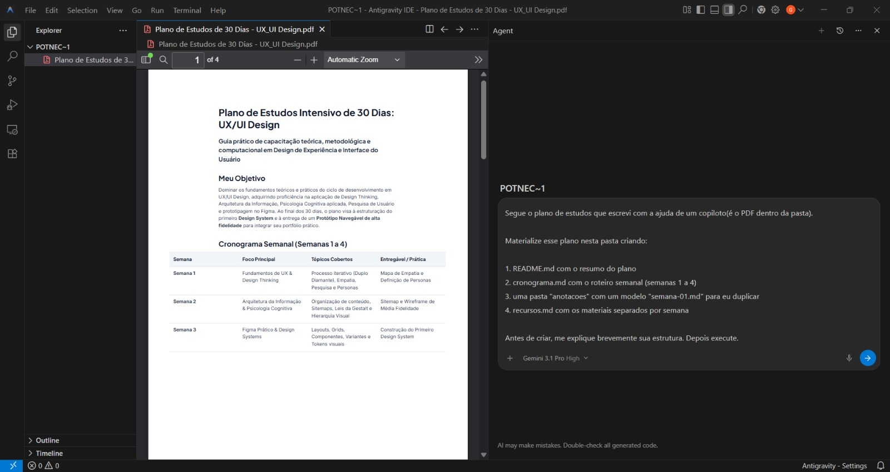
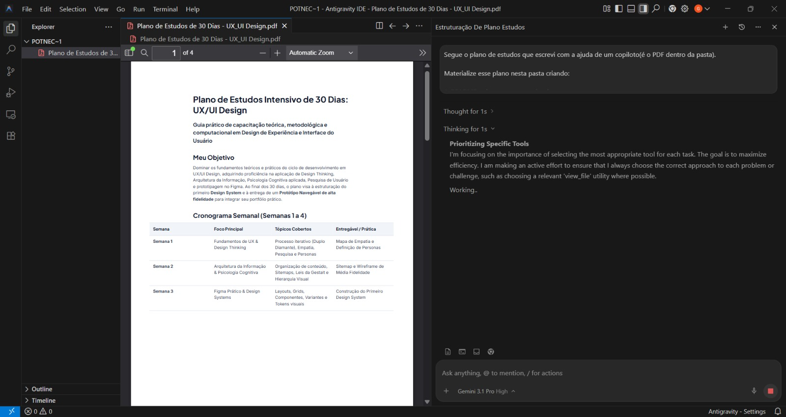
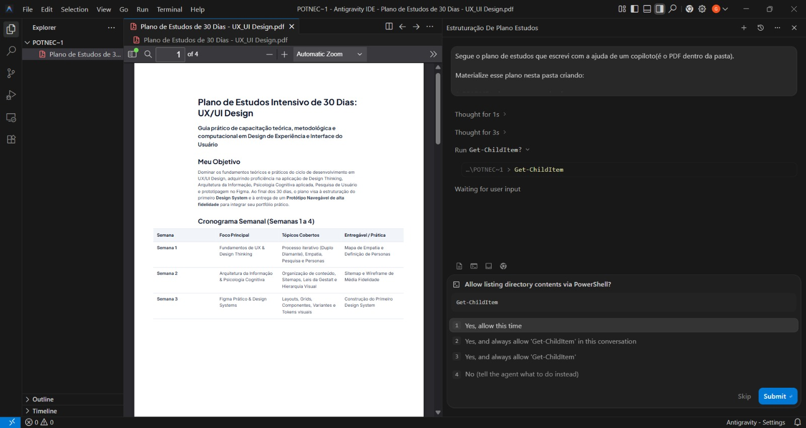
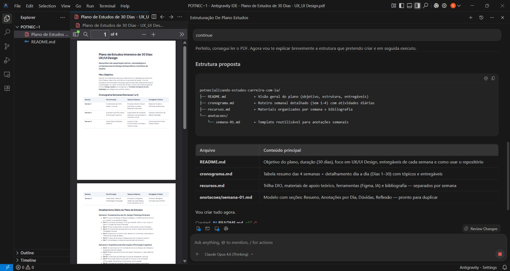
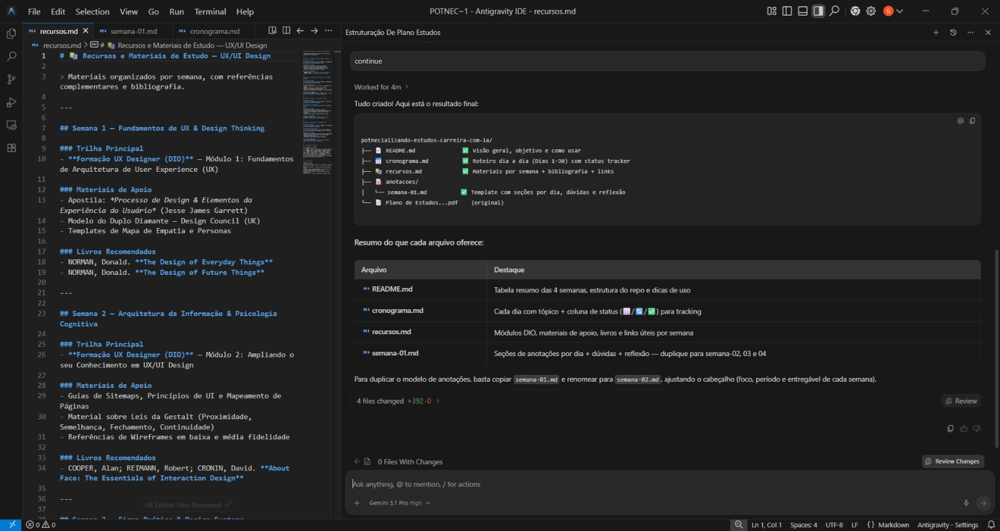

# Anotações: Potencializando Seus Estudos e Carreira com IA (Chatbots, Copilotos e Agentes)

Este documento reúne minhas anotações ao longo das aulas deste curso.

---

### Módulo 1: Sua Jornada Começa Aqui

## Aula 1: De Chatbots a Agentes, o Caminho que Vamos Percorrer

**O que aprendi nesta aula:** 
O foco aqui foi entender como podemos usar a Inteligência Artificial, na prática, para dar um gás nos nossos estudos e na nossa carreira em tecnologia. O professor ressaltou algo muito legal: não precisamos ter experiência prévia com IA, pois o conteúdo vai partir do zero!

Anotei que a nossa interação com a IA vai evoluir em três níveis, do mais básico ao mais autônomo:

1. **Chatbots (O Consultor):** É o nível inicial. É como se eu estivesse consultando um especialista. Eu faço uma pergunta, ele me dá uma resposta. Bem direto ao ponto.
2. **Copilotos (O Colega de Trabalho):** Aqui a coisa já fica mais dinâmica. É como ter um colega do lado olhando o que eu estou fazendo (seja um código ou um documento) e me dando sugestões de melhorias ou completando minhas frases em tempo real.
3. **Agentes (O Assistente de Confiança):** Esse é o nível máximo de autonomia. É como se eu delegasse uma tarefa para alguém de confiança. Eu só digo o que eu preciso (o objetivo final) e o agente se vira para raciocinar, usar ferramentas e me entregar a solução pronta.

> [!IMPORTANT]
> **Conceitos > Ferramentas**
> Uma dica de ouro que o professor deu: o cenário de IA muda tão rápido que novas ferramentas surgem e somem o tempo todo. Por isso, eu não devo me apegar cegamente a uma ferramenta específica, mas sim **entender os conceitos por trás delas**. Entender a lógica do que é um chatbot, um copiloto e um agente é o que vai me permitir escolher e usar qualquer tecnologia no futuro! O professor também avisou que o repositório do curso será atualizado periodicamente para acompanhar essas mudanças no cenário da IA.

---

### Módulo 2: Pergunte e Receba Respostas Inteligentes (Chatbots)

## Aula 1: Como uma boa pergunta muda tudo

**O que aprendi nesta aula:**
Nesta aula, nos aprofundamos no primeiro nível de interação que vimos anteriormente: os **Chatbots**. O professor fez uma analogia muito boa: podemos pensar no chatbot como um consultor particular que está disponível 24 horas por dia para nós.

O fluxo de funcionamento é super simples e natural: eu descrevo a minha dúvida usando linguagem natural e a IA processa isso para me responder da maneira mais adequada possível, baseada no conhecimento que ela tem.

Mas o grande "pulo do gato" da aula foi entender o conceito de **Prompt**. 

**O que é um Prompt?**
Em resumo, o prompt é o conjunto de informações (ou comando) que passamos para as LLMs para que elas processem a nossa pergunta. E aqui entra a regra de ouro: *não existe mágica!* A qualidade da resposta que a inteligência artificial vai me dar está diretamente ligada à qualidade do meu prompt.

O professor comparou isso com tirar uma dúvida com um professor na escola:
- Se eu faço uma pergunta vaga, recebo uma resposta genérica.
- Se eu trago **maior clareza, riqueza de detalhes e aprofundamento/fundamentação** na minha pergunta, o professor (ou, no caso, o chatbot) consegue me dar uma resposta muito melhor e alinhada com o que eu realmente preciso. 

Ou seja, para extrair o máximo do "consultor", o segredo está no detalhamento. Quanto mais rica a pergunta, mais rica a resposta!

---

## Aula 2: Descobrindo o Seu Caminho na Tecnologia

**O que aprendi nesta aula:**
Nesta aula, fomos colocar a mão na massa! O objetivo era conversar com alguns chatbots para descobrir uma área de tecnologia que combinasse com o meu perfil. 

Para que o teste fosse justo e sem o viés de pesquisas que eu já tinha feito antes, fiz tudo em abas anônimas e sem estar logado (testei no ChatGPT e no Google Gemini, já que o Copilot e o Claude exigem login). O mais legal é que, mesmo como visitante anônimo, os modelos entregam respostas muito boas. O professor também comentou sobre recursos bem interessantes que os chatbots modernos têm, como anexar arquivos, enviar áudios e a velocidade de resposta dos modelos.

O professor disponibilizou um template base de prompt para usarmos:

```text
Quero entrar na área de tecnologia, estou em transição de carreira e tenho 1h por dia para estudar.
Meu background é em [sua área de origem, ex.: Psicologia].

Me ajude a decidir por onde começar. Responda assim:

1. Três áreas que combinam com meu perfil, em ordem de afinidade
2. Uma sugestão final de qual escolher e o porquê
3. Cinco tópicos iniciais para estudar nessa área

Use linguagem simples, como se fosse uma conversa com um amigo.
```

Como eu já sou da área de T.I., para conseguir fazer o exercício prático e testar a capacidade de raciocínio do modelo na transição de carreira, tive que "inventar" um background. Resolvi simular um perfil misturando Psicologia e Arquitetura/Urbanismo. Adaptei o template para o meu cenário fictício da seguinte forma:

```text
Quero entrar na área de tecnologia, estou em transição de carreira e tenho 1h por dia para estudar.
Meu background é em Psicologia e Arquitetura e Urbanismo, onde atualmente trabalho com desenho de peças em ferramentas CAD com um controle de qualidade industrial. Adicionalmente, gosto de aplicar técnicas de psicologia em meu dia a dia para entender melhor as pessoas e entregar as minhas demandas com mais qualidade.

Me ajude a decidir por onde começar. Responda assim:

1. Três áreas que combinam com meu perfil, em ordem de afinidade
2. Uma sugestão final de qual escolher e o porquê
3. Cinco tópicos iniciais para estudar nessa área

Use linguagem simples, como se fosse uma conversa com um amigo.
```

**Minha Análise dos Resultados:**
Ambas as IAs compartilharam uma base estrutural muito similar, respondendo diretamente ao meu cenário. As duas elegeram **UX Design** como a melhor opção (número 1), justificando que a área aproveita de imediato a empatia e pesquisa da Psicologia com o senso espacial e estético da Arquitetura. Ambas também sugeriram Gestão de Produto (Product Design) como segunda opção e traçaram uma trilha inicial de estudos praticamente idêntica (fundamentos de UX, pesquisa com usuários, arquitetura da informação e Figma).

As principais diferenças ficaram no tom da conversa, na terceira carreira sugerida e no desfecho:
- **ChatGPT:** Adotou uma postura mais analítica e profissional. Ele indicou QA (Quality Assurance) como terceira via (por causa da minha experiência atual com controle de qualidade industrial) e propôs uma validação bem concreta, sugerindo um experimento de 30 dias para eu criar um mini-projeto prático de portfólio.
- **Google Gemini:** Usou uma linguagem muito mais informal e entusiasmada. Ele sugeriu Front-end Development como terceira alternativa (embora tenha descartado logo em seguida por causa do meu tempo escasso de estudo) e encerrou de forma mais interativa, me convidando a continuar a conversa para detalhar a rotina de estudos.

📁 **Confira as respostas completas:**
- [Resultado ChatGPT](./exemplos/modulo-02-aula-02/Output-Transicao-ChatGPT.pdf)
- [Resultado Google Gemini](./exemplos/modulo-02-aula-02/Output-Transicao-Google-Gemini.pdf)

---

## Aula 3: Questionário Prático (Módulo 2)

**O que aprendi nesta aula:**
Para fechar esse módulo com chave de ouro, tivemos um questionário prático avaliando os conceitos que exploramos nas últimas aulas. O teste foi totalmente focado no uso inteligente dos prompts e relembrou exatamente o caso de uso prático que fizemos: a transição de carreira misturando Psicologia e Arquitetura/CAD.

Como o desafio envolvia responder questões de múltipla escolha baseadas nessa análise com as IAs e na analogia do professor, documentei separadamente todas as perguntas, as respostas que eu acertei e tirei prints de cada etapa para registrar meu progresso (incluindo o resultado final gabaritado!).

🏆 *Você pode conferir o documento com o registro completo deste questionário, junto com as imagens, na nova pasta de desafios:* [Desafio do Módulo 2](./desafios/modulo-02-questionario-pratico/questionario-modulo-02.md)

### Módulo 3: Trabalhe Lado a Lado (Copilotos)

## Aula 1: Quando a IA Entra no Fluxo de Trabalho

**O que aprendi nesta aula:**
Nesta aula, avançamos para o segundo nível de interação com a Inteligência Artificial: os **Copilotos**. Com a evolução dos conceitos que estamos estudando, ganhamos progressivamente mais autonomia. Se o chatbot (visto no módulo anterior) é como um "consultor" a quem você recorre para tirar uma dúvida pontual, o copiloto atua como um **colega de trabalho** sentado ao seu lado.

O grande diferencial do copiloto é que ele enxerga o que você está fazendo em tempo real (seja escrevendo um código, um documento ou uma planilha) e sugere melhorias proativamente, corrigindo sua rota sem que você precise parar para fazer uma pergunta.

**Contexto é tudo!**
Enquanto o chatbot é limitado ao contexto daquela conversa específica, o copiloto tem acesso ao **contexto expandido da ferramenta** na qual ele está integrado. 

Alguns exemplos práticos que discutimos:
- **Google Docs com Gemini:** O copiloto consegue acessar e enriquecer sugestões baseadas no seu contexto pessoal. Você pode, por exemplo, pedir para o Gemini ler seus outros arquivos do Google Drive ou até e-mails do Gmail para sintetizar tarefas diretamente no documento que você está editando. Ele te conhece melhor e usa essas informações como referência.
- **IDEs (Ambientes de Desenvolvimento):** Na área de programação, copilotos analisam o código que você está escrevendo e o contexto do projeto para sugerir trechos de código e otimizar o fluxo de desenvolvimento.

Em resumo, a IA no formato de copiloto entra organicamente no seu fluxo de trabalho, atuando de forma colaborativa para aumentar sua produtividade de maneira contínua e inteligente.

---

## Aula 2: Estruturando seu Plano com Sugestões em Tempo Real

**O que aprendi nesta aula:**
Nesta aula, fomos para a prática! Após entender o conceito de Copilotos, testamos o **Gemini** integrado diretamente no **Google Docs** para montar um plano de estudos personalizado. A premissa foi usar a IA para coletar informações no meu próprio ecossistema (Gmail e Drive) e me ajudar a planejar o estudo da área que escolhi no módulo anterior.

**Passo a passo da prática:**
1. Criei um novo arquivo em branco no Google Docs.
2. Acessei a ferramenta "Escrever com o Gemini" (Help me write).
3. Utilizei o template de prompt sugerido e adaptei para o meu cenário. 

Como no módulo anterior eu havia simulado uma transição para **UX/UI Design**, colei os 5 tópicos iniciais mapeados e estruturei o meu prompt final assim:

```text
Crie um plano de estudos de 30 dias para mim.

Área escolhida: UX/UI Design (User Experience / User Interface) 
Tópicos iniciais: 
1. Design Thinking: Entenda o processo de empatia, definição, idealização e prototipagem. É o "esqueleto" de como se resolve problemas em tech.
2. Psicologia Cognitiva aplicada ao Design: Estude como as pessoas percebem cores, formas e hierarquia de informação (leis da Gestalt, por exemplo).
3. Arquitetura da Informação: Como organizar o conteúdo de forma lógica (muito parecido com planejar o fluxo de pessoas em um prédio!).
4. Pesquisa com Usuário (User Research): Como entrevistar pessoas e observar comportamentos para validar se sua ideia faz sentido.
5. Figma (Ferramenta): É o "CAD" do designer de tecnologia. Comece a brincar com ele; é gratuito e a ferramenta padrão do mercado hoje.

Estruture com:
- Meu objetivo
- Cronograma semanal (semanas 1 a 4) distribuindo os tópicos
- Materiais e referências por semana, priorizando o conteúdo da formação UX Designer da DIO (https://www.dio.me/curso-ux-design)

Considere conteúdos sobre essa área que estejam nos meus emails ou no meu Drive.
Sugerindo assim, materiais que já fazem parte do meu contexto (sem expor dados sensíveis, como nomes de empresas e produtos).
```

**Análise e Refinamento dos Resultados:**
A experiência foi fantástica! A IA começou a vasculhar minhas informações do Gmail e Drive e montou um cronograma perfeitamente alinhado com o meu contexto e referências pré-existentes. 

> [!TIP]
> **O copiloto te conhece, o chatbot não:** Ao pedir que o copiloto considere seus e-mails e arquivos, ele pode incluir cursos em que você já se inscreveu, newsletters ou documentos salvos. Essa é a grande diferença entre um chatbot convencional e um copiloto integrado ao seu ambiente!

O grande aprendizado aqui foi sobre o **refinamento interativo**: o copiloto não entrega apenas um resultado estático. Conforme ajustamos o plano, pude fazer o seguinte:
- **Sugestões em tempo real:** Ao digitar no documento, o copiloto sugere continuações que se adaptam ao meu jeito de escrever (basta aceitar as que fazem sentido e ignorar as outras).
- **Reescrever trechos pontuais:** Selecionei parágrafos específicos e pedi, por exemplo: *"Reescreva este trecho de forma mais clara e motivadora"*. Pedi também uma síntese mais coesa, resumida e direta de todo o plano. 

A IA gerou uma segunda versão muito mais enxuta, e eu fui sempre avaliando e aprovando as alterações num verdadeiro fluxo de trabalho "lado a lado". Ao final, exportei os resultados em PDF para registrar os planos de estudos gerados.

📁 **Confira os planos de estudo gerados (salvos em PDF):**
- [Plano de Estudos - Versão Inicial](./exemplos/modulo-03-aula-02/Output-1-Plano%20de%20Estudos%20de%2030%20Dias%20-%20UX_UI%20Design.pdf)
- [Plano de Estudos - Versão Refinada (Objetiva e Direta)](./exemplos/modulo-03-aula-02/Output-2-Plano%20de%20Estudos%20de%2030%20Dias%20-%20UX_UI%20Design.pdf)

---

## Aula 3: O Copiloto na Prática (E-mail e IDE)

**O que aprendi nesta aula:**
Nesta aula, aprofundamos ainda mais o uso de copilotos no nosso dia a dia, testando na prática como a IA pode acelerar e melhorar a qualidade do nosso trabalho em diferentes ferramentas. Fizemos testes em duas frentes: na redação de e-mails e dentro do ambiente de desenvolvimento (IDE).

**1. Escrevendo E-mails mais Profissionais (Gmail com IA):**
Começamos testando a IA diretamente no e-mail. A primeira coisa que notei foi o **auto-complete inteligente** ([ver print](./exemplos/modulo-03-aula-03/01-email-auto-complete.png)): ao começar a digitar algumas palavras, a IA já sugeria o complemento da frase, o que agiliza muito a escrita. 
Além disso, ao terminar de escrever a mensagem, utilizei a opção de **melhorar o texto com a IA do Gemini** ([ver print](./exemplos/modulo-03-aula-03/02-email-melhorar-texto.png)), que é acionada facilmente usando a tecla Tab. O resultado foi incrível: o Gemini pegou a minha mensagem original e gerou um e-mail muito mais bem redigido e polido ([ver resultado pós-melhoria](./exemplos/modulo-03-aula-03/03-email-resultado-melhoria.png)). É uma funcionalidade excelente para trazer mais qualidade e profissionalismo para a nossa comunicação diária.

**2. Codificando com um Copiloto na IDE (IntelliJ):**
O próximo teste foi no meu "habitat natural", a IDE! Escolhi utilizar o IntelliJ e simulei um exemplo simples de um programa para somar dois números. 
Para dar o contexto, criei um comentário na primeira linha descrevendo "Programa que soma dois números". A partir desse comentário, o copiloto entrou em ação instantaneamente: ele foi me dando o **auto-complete das variáveis** ([ver print](./exemplos/modulo-03-aula-03/04-ide-auto-complete-variaveis.png)) que eu precisava criar e, em seguida, já sugeriu o **método de soma** completo ([ver print](./exemplos/modulo-03-aula-03/05-ide-auto-complete-metodo.png)), escrevendo a lógica que faria a soma e já exibiria o resultado dessas duas variáveis. Tudo isso em tempo real!

**Síntese Final:**
A principal conclusão desses testes práticos é o quanto os copilotos agilizam o nosso trabalho diário sem tirar o nosso controle. Seja para redigir um e-mail profissional ou para codificar na IDE, a IA atua literalmente como uma parceira que observa o seu contexto (o texto que você começou a escrever ou o comentário em código) e antecipa os seus próximos passos. O ganho de produtividade é gigantesco, permitindo que a gente foque muito mais no raciocínio e no objetivo final do que no "trabalho braçal" de digitação.

---

## Aula 4: Questionário Prático (Módulo 3)

**O que aprendi nesta aula:**
Para fechar os estudos sobre Copilotos, realizamos um questionário prático que testou nossos conhecimentos sobre o funcionamento dessas ferramentas. As questões reforçaram bastante a importância de darmos um bom contexto (como comentários de código) para extrair o melhor das sugestões em tempo real, assim como a diferença progressiva de autonomia entre chatbots, copilotos e agentes.

Assim como no módulo anterior, documentei separadamente as perguntas, as respostas que acertei e tirei prints de cada etapa para registrar meu progresso.

🏆 *Você pode conferir o documento com o registro completo deste questionário na pasta de desafios:* [Desafio do Módulo 3](./desafios/modulo-03-questionario-pratico/questionario-modulo-03.md)

---

### Módulo 4: Delegue e Acompanhe (Agentes)

## Aula 1: O Que Muda Quando a IA Decide e Executa

**O que aprendi nesta aula:**
Chegamos ao último nível da nossa jornada de interação: os **Agentes de IA**! Esse é o tópico que está mais em alta no mercado atual. A ideia de "agentes" acaba sendo abstraída por diferentes provedores em ferramentas com nomes distintos. Por exemplo: a OpenAI tem suas soluções baseadas em código (como o Codex), a Anthropic possui o Claude Code, e o Google possui o Antigravity. 

**Especialização vs. Generalismo:**
Existem agentes com especialidades distintas. Enquanto o Antigravity ou o Claude Code, por exemplo, são fortemente focados em código e desenvolvimento de software, existem outros agentes (como o OpenClaw) que possuem um viés muito mais generalista, permitindo que você resolva problemas e execute tarefas de maneira muito mais ampla.

**A Grande Diferença: Autonomia e Delegação**
Se com Chatbots nós *perguntávamos*, e com Copilotos nós trabalhávamos *lado a lado*, com os Agentes o foco principal é **delegar**. 

Aqui estão as principais mudanças que anotei:
- **Você vira um Supervisor:** O fluxo de trabalho muda. Você explica de maneira super detalhada o que deseja que seja feito. O agente vai analisar o seu pedido e **decidir** por conta própria o que executar. O seu papel passa a ser o de um supervisor que acompanha o processo e fornece feedbacks para corrigir a rota, se necessário.
- **Autonomia Operacional:** Nos módulos anteriores, as IAs operavam em um ambiente isolado (numa aba do navegador ou presas dentro do contexto de uma ferramenta, como a IDE ou o Word). Agora, o agente consegue ter autonomia no nível operacional da sua própria máquina! Ele pode criar arquivos, executar comandos no terminal, ou até mandar mensagens no WhatsApp (sempre respeitando as permissões que você concedeu a ele).
- **Raciocínio Integrado (Reflexão Constante):** Esses agentes rodam em conjunto com LLMs (Large Language Models) e possuem uma capacidade fundamental: a de *avaliar suas próprias respostas*. Quando pedimos algo, o agente pode pensar, verificar se a abordagem é boa, refletir, agir e repensar. Ele entra num ciclo contínuo de pensamento e ação para chegar no melhor resultado possível de forma autônoma.

---

## Aula 2: Recebendo seu Workspace de Estudos Pronto

**O que aprendi nesta aula:**
Nesta aula, colocamos em prática o conceito de Agentes de IA, delegando a criação e organização completa do nosso ambiente de estudos de forma autônoma. Abaixo, dividi todo o processo em etapas para detalhar como isso aconteceu:

### Etapa 1: Estruturando o Workspace
Nesta aula, fomos para a prática com os Agentes de IA! O primeiro passo foi estruturar o nosso espaço de trabalho. Criei uma nova pasta na minha área de trabalho com o nome `potencializando-estudos-carreira-com-ia`, seguindo as instruções do curso.

### Etapa 2: A Escolha do Agente (Antigravity)
Para viabilizar o uso do agente, decidimos utilizar o **Antigravity**, uma solução de encapsulamento de agentes desenvolvida pelo Google. Uma das grandes vantagens dessa ferramenta é que ela possui um plano gratuito com limites generosos, disponibilizando modelos de ponta de diferentes provedores, como o próprio Google, Anthropic e OpenAI.

### Etapa 3: O Desafio Prático e Contexto
A tarefa era entregar o plano de estudos gerado na prática anterior e pedir para o agente materializar esse plano na nova pasta. 

Utilizamos o seguinte prompt (template):

```text
Segue o plano de estudos que escrevi com a ajuda de um copiloto (é o PDF que está dentro da pasta).

Materialize esse plano nesta pasta criando:

1. README.md com o resumo do plano
2. cronograma.md com o roteiro semanal (semanas 1 a 4)
3. uma pasta "anotacoes" com um modelo "semana-01.md" para eu duplicar
4. recursos.md com os materiais separados por semana

Antes de criar, me explique brevemente sua estrutura. Depois execute.
```

> **Resultado:** Você pode conferir os arquivos reais que o agente criou a partir desse prompt acessando os links abaixo:
> - [README.md](./exemplos/modulo-04-aula-02/potnecializando-estudos-carreira-com-ia/README.md)
> - [cronograma.md](./exemplos/modulo-04-aula-02/potnecializando-estudos-carreira-com-ia/cronograma.md)
> - [anotacoes/semana-01.md](./exemplos/modulo-04-aula-02/potnecializando-estudos-carreira-com-ia/anotacoes/semana-01.md)
> - [recursos.md](./exemplos/modulo-04-aula-02/potnecializando-estudos-carreira-com-ia/recursos.md)

Para dar ainda mais contexto e embasar as decisões do agente, inseri no workspace o arquivo PDF contendo o plano de estudos criado anteriormente pelo copiloto.

<div align="center">
  <em>Workspace com PDF e Prompt Colado</em><br>
  
  <br>
  <sup>Fonte: Autoral (2026)</sup>
</div>

### Etapa 4: O Fluxo de Ação do Agente

1. **Processamento Inicial:** Após enviar o comando e o contexto (PDF), o agente começou a refletir sobre o input, mostrando na prática o seu ciclo de raciocínio autônomo.

<div align="center">
  <em>Agente pensando no input</em><br>
  
  <br>
  <sup>Fonte: Autoral (2026)</sup>
</div>

2. **Permissão e Segurança:** Antes de realizar alterações no meu computador (como executar comandos no terminal), o agente pediu a minha autorização expressa. Isso demonstra perfeitamente o nosso papel como "supervisor".

<div align="center">
  <em>Agente pedindo permissão</em><br>
  
  <br>
  <sup>Fonte: Autoral (2026)</sup>
</div>

3. **Plano de Execução:** Ele apresentou um resumo claro de tudo o que faria na pasta.

<div align="center">
  <em>Agente resumindo o que ia fazer</em><br>
  
  <br>
  <sup>Fonte: Autoral (2026)</sup>
</div>

4. **Entrega Final:** Após a autorização, ele executou a tarefa de forma autônoma (criou os arquivos e a pasta de anotações) e, ao final, exibiu um resumo consolidado do que cada arquivo recém-criado oferecia para os meus estudos.

<div align="center">
  <em>Agente exibindo resultado</em><br>
  
  <br>
  <sup>Fonte: Autoral (2026)</sup>
</div>

---

## Aula 3: Organizando Imagens e Acessando o Browser com Agentes de IA

**O que aprendi nesta aula:**
Nesta aula, levamos a autonomia do agente para um outro nível! O foco foi delegar tarefas complexas de organização de arquivos locais e integrar a Inteligência Artificial diretamente à nossa navegação na web. 

Para demonstrar a versatilidade dos provedores no Antigravity, o instrutor trocou o modelo para o **Claude 3.5 Sonnet** (da Anthropic) e iniciou duas práticas impressionantes:

### Etapa 1: Organização Automática de Arquivos
O instrutor abriu uma pasta lotada de screenshots desorganizadas e pediu para o agente organizar tudo em subpastas com base na data de criação de cada arquivo. 
- O Claude interpretou a demanda perfeitamente e, como um bom assistente, solicitou permissão para executar um comando de filtragem no PowerShell.
- O detalhe mais genial da execução foi a forma como ele fez isso: o agente codificou um script do zero para ler e organizar as datas, executou esse script, separou todas as imagens nas pastas corretas e, por fim, **excluiu o próprio script**! Ele fez o trabalho completo, limpou a sujeira e entregou apenas o resultado final desejado.

### Etapa 2: Interação com o Browser (Navegador)
A segunda prática envolveu o teste de uma característica incrível do Antigravity: o recurso `open browser`. Quando ativado, o agente abre uma instância do navegador e ganha acesso ao conteúdo da página em que você está navegando.
- O instrutor abriu um artigo dentro da plataforma da DIO e enviou um desafio: pediu para o agente extrair o conteúdo e gerar um checklist estruturado em um arquivo `.md` local, para que ele pudesse ir checando cada item depois.
- Assim que o agente recebe o prompt e começa a pensar, a tela do navegador ganha uma **borda azul**, indicando visualmente que ele está operando ali e tem acesso aos recursos daquela página.
- O agente começou a realizar processos de scan no DOM, rolando a página, interpretando os elementos e extraindo as informações. 
- Após analisar a página, ele gerou um *Task Plan* (plano de tarefas) detalhando o que faria. Ao final da execução, recebi meu arquivo Markdown local com o checklist impecável, enriquecido com dicas extras e referências do próprio artigo.

### Etapa 3: Configurações e Customizações Avançadas
Para fechar a aula, exploramos um pouco do painel de configurações (Settings) e do ecossistema do workspace:
- **Gerenciamento de Modelos e Cotas:** Vimos onde acompanhar o uso das cotas dos modelos. Isso é fundamental para gerenciar limites nos planos gratuitos (ou gastos, no caso de quem usa APIs pagas).
- **Notificações e Permissões:** O ambiente possui controles robustos de notificações e abas de agentes/permissões. É muito legal ter essa clareza sobre o que o agente pode ou não fazer no sistema, mantendo a segurança do nosso computador.
- **Histórico de Chats:** Por fim, conhecemos a área de histórico de conversas do workspace, uma mão na roda para não perdermos o contexto de raciocínios anteriores com a IA.