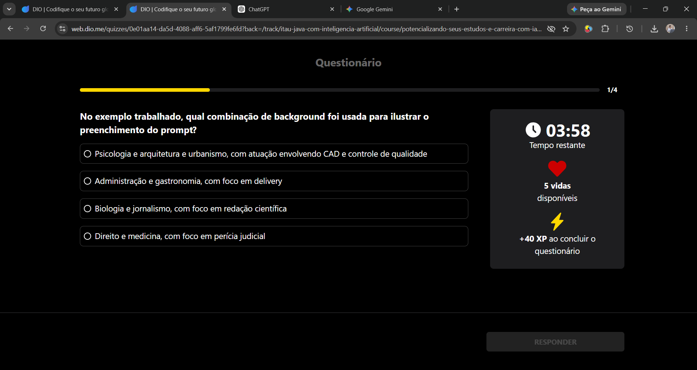
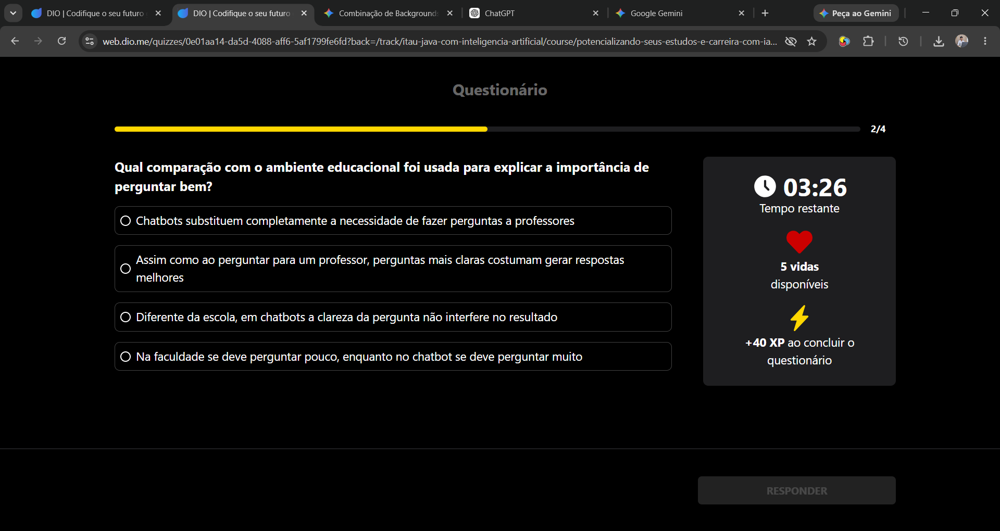
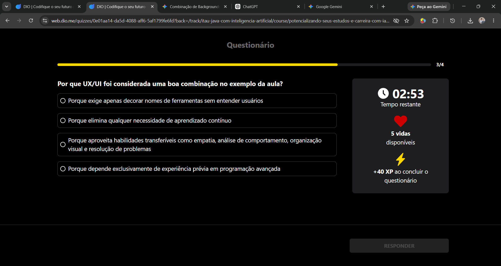
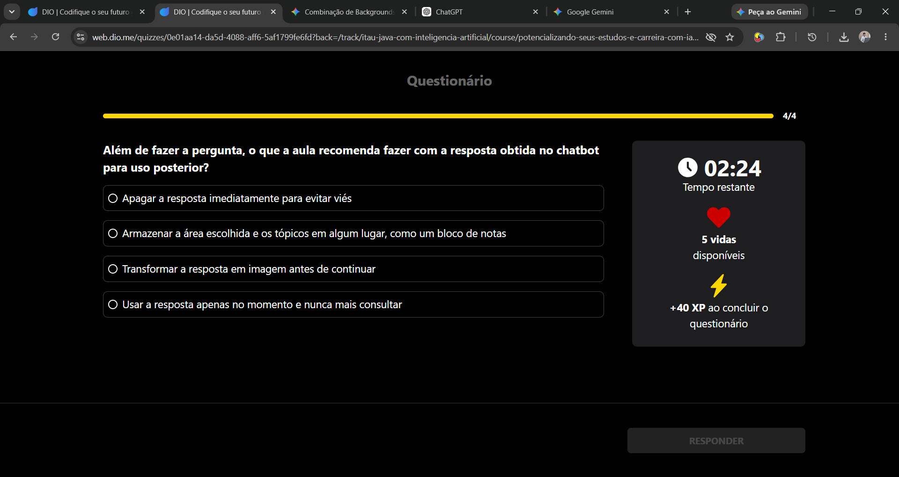
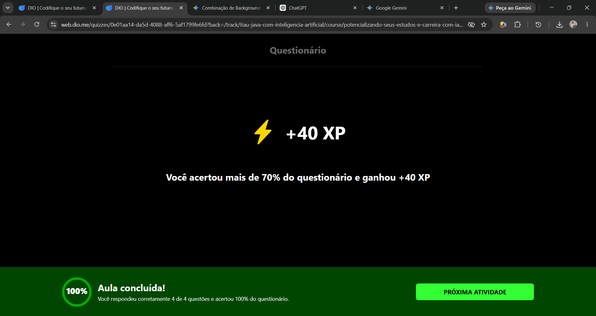

# Desafio / Questionário: Pergunte e Receba Respostas Inteligentes (Chatbots)

Este desafio faz parte do Módulo 2 do Curso 03. Abaixo estão as perguntas, as respostas corretas do teste e os registros visuais (prints) de cada etapa.

## Questão 1 (1/4)
**Pergunta:** No exemplo trabalhado, qual combinação de background foi usada para ilustrar o preenchimento do prompt?

**Resposta Correta:** Psicologia e arquitetura e urbanismo, com atuação envolvendo CAD e controle de qualidade.

## Questão 2 (2/4)
**Pergunta:** Qual comparação com o ambiente educacional foi usada para explicar a importância de perguntar bem?

**Resposta Correta:** Assim como ao perguntar para um professor, perguntas mais claras costumam gerar respostas melhores.

## Questão 3 (3/4)
**Pergunta:** Por que UX/UI foi considerada uma boa combinação no exemplo da aula?

**Resposta Correta:** Porque aproveita habilidades transferíveis como empatia, análise de comportamento, organização visual e resolução de problemas.

## Questão 4 (4/4)
**Pergunta:** Além de fazer a pergunta, o que a aula recomenda fazer com a resposta obtida no chatbot para uso posterior?

**Resposta Correta:** Armazenar a área escolhida e os tópicos em algum lugar, como um bloco de notas.

---

## Resultado Final do Desafio
Ao final, finalizei o questionário com sucesso! 

