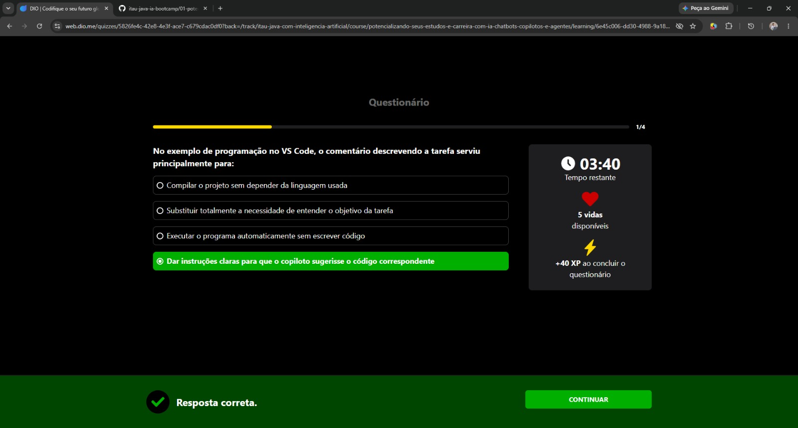
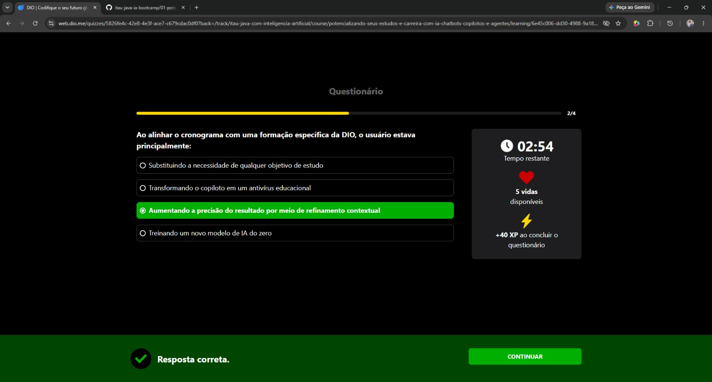
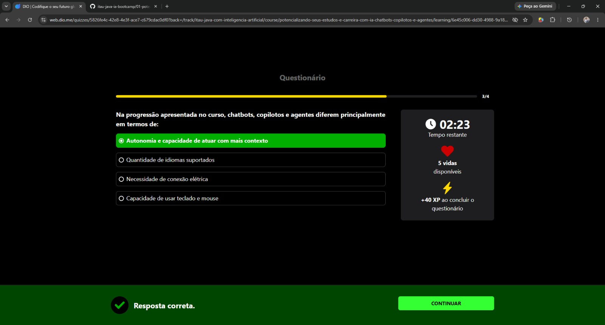
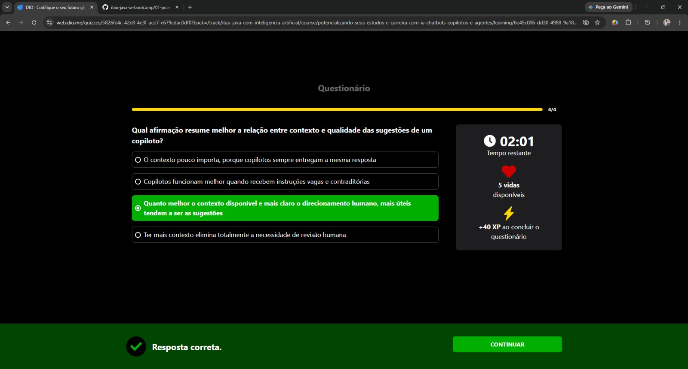

# Desafio / Questionário: Trabalhe Lado a Lado (Copilotos)

Este desafio faz parte do Módulo 3 do Curso 03. Abaixo estão as perguntas, as respostas corretas do teste e os registros visuais (prints) de cada etapa.

## Questão 1 (1/4)
**Pergunta:** No exemplo de programação no VS Code, o comentário descrevendo a tarefa serviu principalmente para:

**Resposta Correta:** Dar instruções claras para que o copiloto sugerisse o código correspondente

## Questão 2 (2/4)
**Pergunta:** Ao alinhar o cronograma com uma formação específica da DIO, o usuário estava principalmente:

**Resposta Correta:** Aumentando a precisão do resultado por meio de refinamento contextual

## Questão 3 (3/4)
**Pergunta:** Na progressão apresentada no curso, chatbots, copilotos e agentes diferem principalmente em termos de:

**Resposta Correta:** Autonomia e capacidade de atuar com mais contexto

## Questão 4 (4/4)
**Pergunta:** Qual afirmação resume melhor a relação entre contexto e qualidade das sugestões de um copiloto?

**Resposta Correta:** Quanto melhor o contexto disponível e mais claro o direcionamento humano, mais úteis tendem a ser as sugestões.

---

## Resultado Final do Desafio
Ao final, finalizei o questionário com sucesso! 

