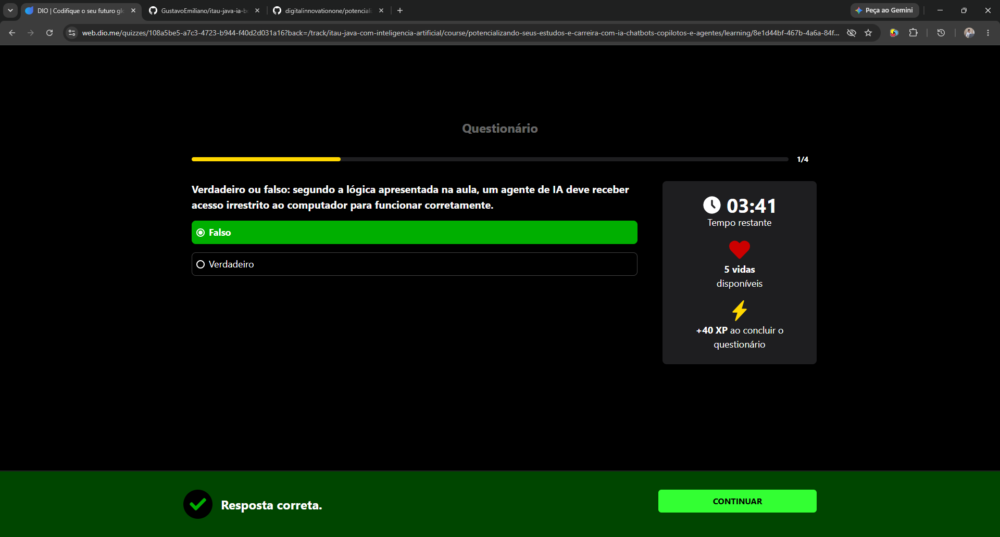
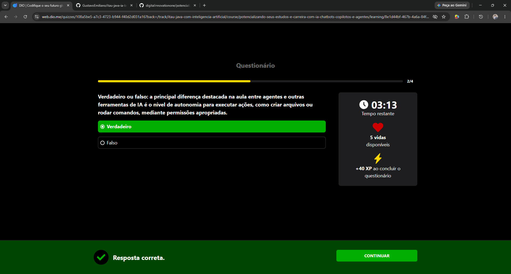
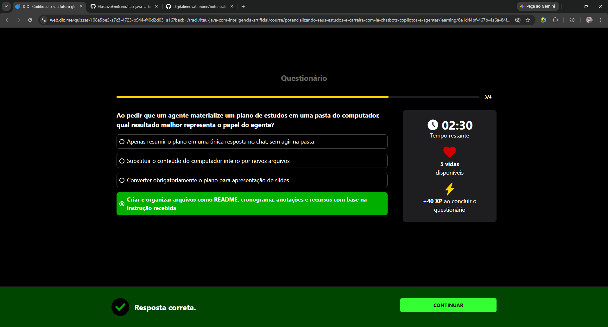
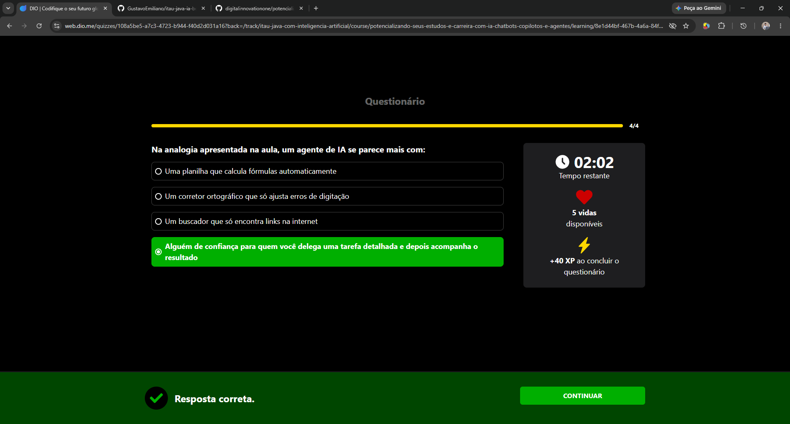
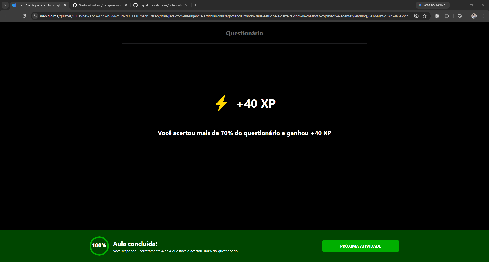

# Desafio / Questionário: Delegue e Acompanhe (Agentes)

Este desafio faz parte do Módulo 4 do Curso 03. Abaixo estão as perguntas, as respostas corretas do teste, justificativas, e os registros visuais (prints) de cada etapa.

## Questão 1 (1/4)
**Pergunta:** Verdadeiro ou falso: segundo a lógica apresentada na aula, um agente de IA deve receber acesso irrestrito ao computador para funcionar corretamente.

**Resposta Correta:** Falso.

**Justificativa:** Liberar acesso total e sem limites pro agente é arriscado demais. O correto é sempre limitar as permissões apenas para a pasta ou ferramentas que ele realmente precisa usar no momento, garantindo o controle e a segurança da máquina.

## Questão 2 (2/4)
**Pergunta:** Verdadeiro ou falso: a principal diferença destacada na aula entre agentes e outras ferramentas de IA é o nível de autonomia para executar ações, como criar arquivos ou rodar comandos, mediante permissões apropriadas.

**Resposta Correta:** Verdadeiro.

**Justificativa:** Diferente de um chatbot comum que só responde com texto na tela, o agente tem autonomia para agir no ambiente com as devidas autorizações, conseguindo criar pastas, editar arquivos e rodar comandos práticos.

## Questão 3 (3/4)
**Pergunta:** Ao pedir que um agente materialize um plano de estudos em uma pasta do computador, qual resultado melhor representa o papel do agente?

**Resposta Correta:** Criar e organizar arquivos como README, cronograma, anotações e recursos com base na instrução recebida.

**Justificativa:** "Materializar" significa tirar a ideia só da conversa e transformar em arquivos reais organizados no sistema (como criar o cronograma, notas e links dentro da pasta de estudos), cumprindo o que foi pedido sem apagar nem afetar o resto do computador.

## Questão 4 (4/4)
**Pergunta:** Na analogia apresentada na aula, um agente de IA se parece mais com:

**Resposta Correta:** Alguém de confiança para quem você delega uma tarefa detalhada e depois acompanha o resultado.

**Justificativa:** O agente funciona como um assistente para quem você passa o contexto e os passos da tarefa, permitindo que ele trabalhe de forma semi-autônoma enquanto você revisa o que foi entregue no final.

---

## Resultado Final do Desafio
Ao final, finalizei o questionário com sucesso! 

