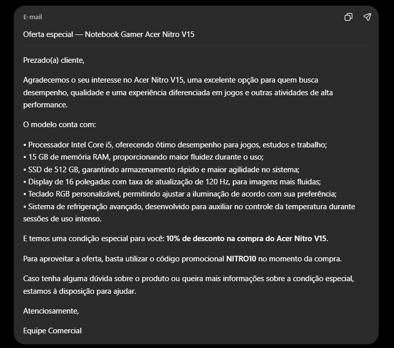
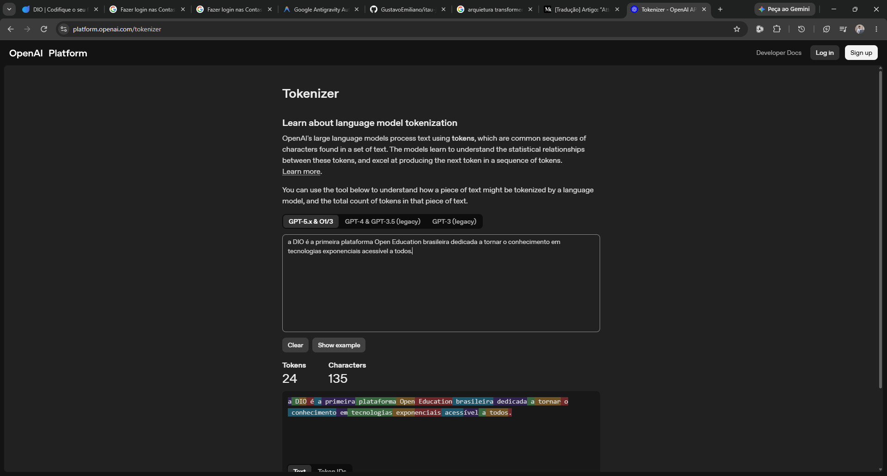
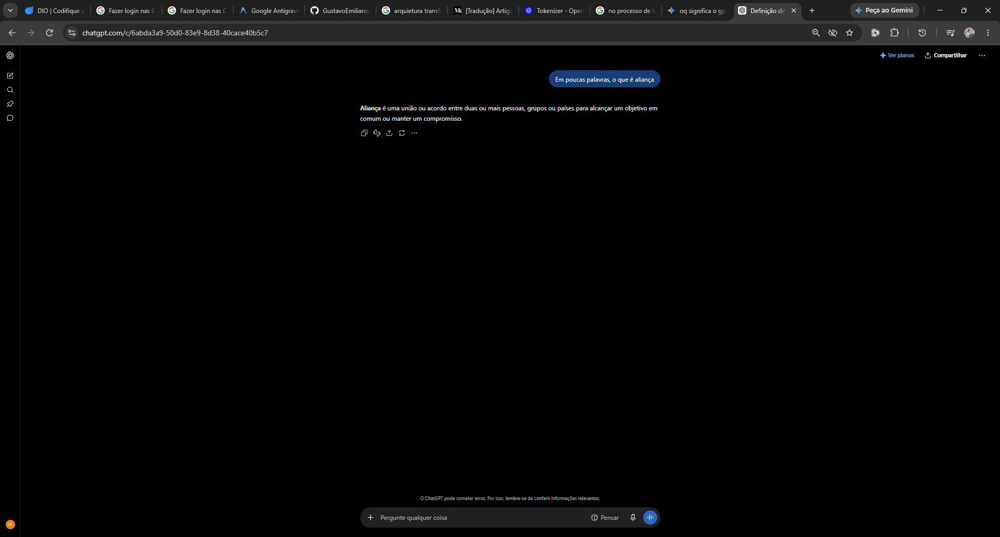
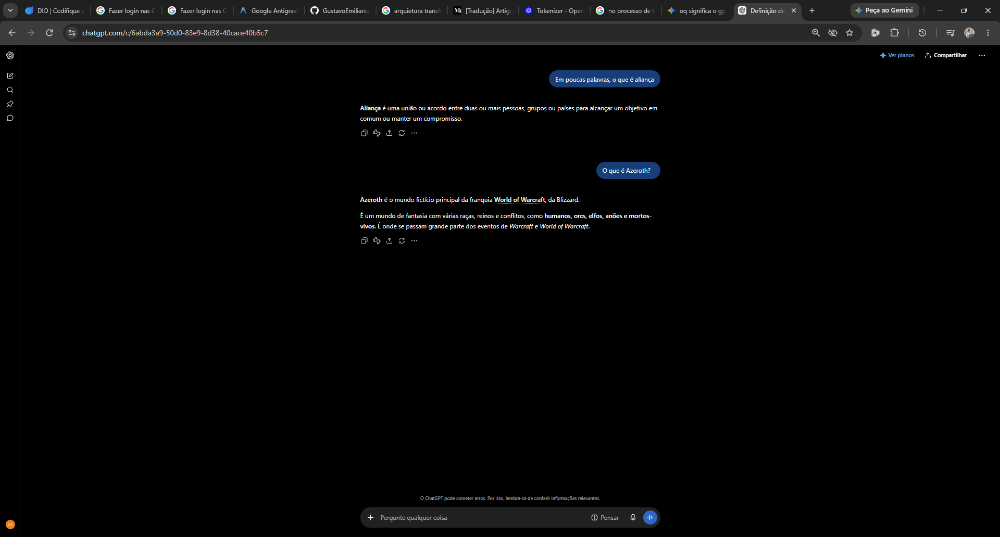
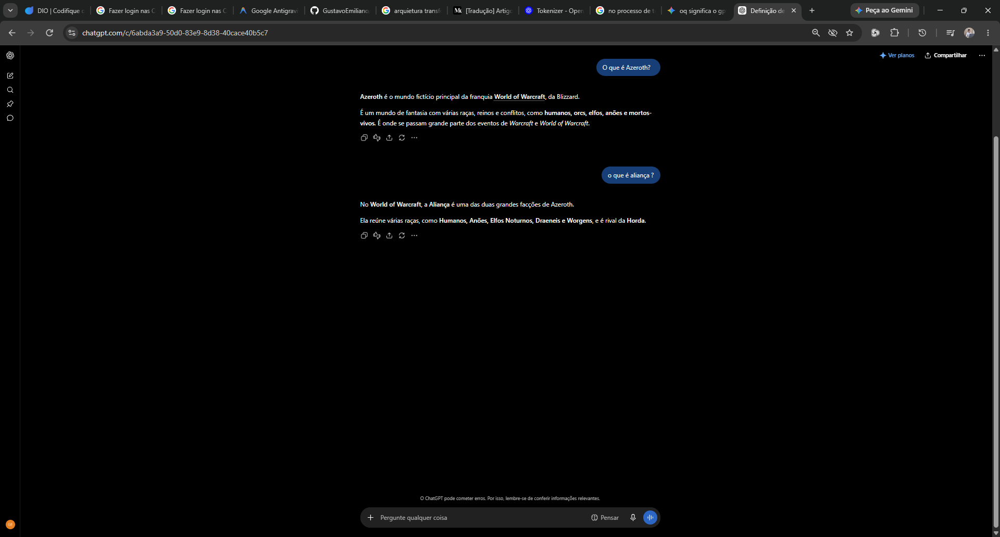
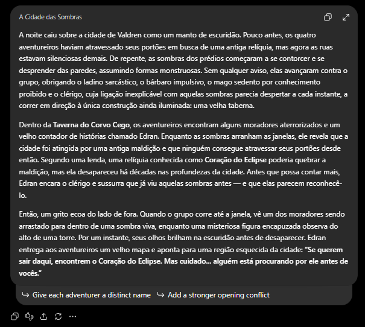

# Anotações: Introdução à Engenharia de Prompts

Este documento reúne minhas anotações ao longo das aulas deste curso.

---

### Módulo 1: Introdução

## Aula 1: Por que aprender Engenharia de Prompts?

**O que aprendi nesta aula:**
Nesta primeira aula do curso, conduzida pela instrutora Elidiana Andrade (Tech Education Analyst na DIO), tivemos uma introdução sobre os motivos pelos quais dominar a Engenharia de Prompts é tão importante hoje em dia, antes mesmo de explorarmos ferramentas e conceitos mais profundos.

A instrutora fez uma analogia excelente que deixou tudo muito claro: **o exemplo da pizzaria**. 
Imagine que você está com fome e manda a seguinte mensagem para a pizzaria: *"Oi, quero uma pizza"*. O atendente vai ter que fazer diversas perguntas (Qual o sabor? Qual o tamanho? É para entregar?), simplesmente porque você não deu detalhes suficientes. 

O mesmo acontece com os modelos de Inteligência Artificial: se você não for claro no seu pedido, a IA ficará perdida e te dará respostas genéricas, vagas ou imprecisas.

**Exemplo Prático: Escrevendo um E-mail**
Se pedirmos para a IA apenas *"Escreva um e-mail para um cliente"*, ela entregará um texto genérico, pois não sabe:
- O motivo do e-mail
- O tom de voz que deve ser utilizado
- O que precisa ser destacado ou qual é a informação essencial

Para que a IA entregue um resultado ideal e útil, o pedido precisa ser **específico**. 

Abaixo, um exemplo de um "bom pedido" (um bom prompt) testado na aula:

```text
Escreva um e-mail formal para um cliente que está interessado em um notebook gamer chamado Acer Nitro V15. 

Destaque as principais características do produto, como:
- Processador interno i5
- Memória RAM 15GB
- SSD 512GB
- Display de 16 polegadas com taxa de atualização de 120Hz
- Teclado RGB personalizável
- Refrigeração avançada

Além disso, ofereça um desconto especial de 10% e inclua um código promocional. O tom deve ser profissional, mas amigável.
```

<br>
<div align="center">
  <em>Exemplo Prático: Prompt no ChatGPT</em><br>
  <a href="./exemplos/modulo-01-aula-01/Output-Email-Acer-Nitro.pdf">
    
  </a>
  <br>
  <sup>Fonte: Autoral (2026)</sup>
</div>
<br>

**Análise do Teste:**
Com base nesse teste prático, ficou evidente que a qualidade do prompt influencia diretamente a qualidade da resposta do modelo. Quanto mais claros e específicos formos, melhor será o resultado entregue pela IA.

**Definições Importantes:**
- **Prompt:** É a mensagem ou o comando direto que você envia ao Modelo de IA.
- **Engenharia de Prompts:** É a habilidade de formular esses comandos de forma eficaz e inteligente, garantindo que a IA gere exatamente a resposta e o resultado que você realmente precisa.

> [!IMPORTANT]
> **Uma Habilidade para a Vida**
> Saber formular bons prompts não é apenas uma habilidade técnica restrita a programadores. É uma habilidade prática e versátil que pode transformar tanto a vida profissional quanto a pessoal!
> 
> Com ela, podemos:
> - Escrever e-mails e redigir textos muito mais rápido.
> - Obter resumos de documentos longos de maneira eficiente.
> - Gerar ideias criativas para novos projetos.
> 
> Usando a Engenharia de Prompts de maneira inteligente, o principal ganho é conseguir poupar um tempo e um esforço absurdos no dia a dia.

---

## Aula 2: O que você precisa para começar?

**O que aprendi nesta aula:**
Nesta aula, discutimos sobre os pré-requisitos para começar na Engenharia de Prompts. A mensagem principal é que **não é necessário ser um especialista em Inteligência Artificial** para aprender e utilizar essa habilidade no dia a dia.

No entanto, é muito importante ter noções básicas sobre dois pilares que dão base a tudo:
- **Processamento de Linguagem Natural (PLN):** É a área da Inteligência Artificial que trata da interação entre máquinas e a linguagem humana. É essa tecnologia que permite que o computador entenda o texto que escrevemos.
- **Modelos de Linguagem de Grande Escala (LLMs):** São modelos treinados com volumes gigantescos de dados textuais para conseguir gerar e entender textos de forma incrivelmente eficiente, com uma semântica muito próxima à nossa.

**Ferramentas Práticas:**
Ao longo das próximas aulas, a instrutora pontuou que vamos utilizar ferramentas de mercado que abstraem essa parte técnica pesada e facilitam a nossa interação direta com a IA. Entre elas, focaremos bastante no:
- **ChatGPT** (da OpenAI)
- **Microsoft Copilot**

---

## Aula 3: O que vamos explorar neste curso?

**O que aprendi nesta aula:**
Nesta aula, a instrutora apresentou um panorama (overview) completo de tudo o que vamos aprender. O conteúdo do curso foi dividido para nos ajudar a elevar a qualidade dos nossos prompts ao próximo nível, passando pelos seguintes pilares:

1. **Visão Geral e Funcionamento da IA:**
   - Como os modelos de linguagem realmente "entendem" um prompt.
   - Como funciona o processamento dessas informações através de **Tokens**.
   - Como as IAs conseguem lembrar do que foi dito anteriormente na conversa, através do conceito de **Janela de Contexto**.

2. **A Arte de Formular um Bom Prompt:**
   - Quais são os elementos essenciais para estruturar um comando perfeito.
   - Como exemplo prático, veremos a criação de uma história e ambientação para um RPG de mesa!

3. **Aplicações Práticas e Cuidados:**
   - Como utilizar a Engenharia de Prompts no dia a dia, tanto para otimizar tarefas da vida pessoal quanto da vida profissional.
   - **Cuidados na aplicação:** Um alerta muito importante sobre os riscos, limitações e boas práticas ao usar os modelos de IA.

---

### Módulo 2: Visão Geral da Engenharia de Prompts

## Aula 1: Como os Modelos de Linguagem "Entendem" um Prompt?

**O que aprendi nesta aula:**
Para iniciar nossa visão geral sobre a engenharia de prompts, a instrutora explicou a forma técnica de como as IAs interagem com o texto. 

As LLMs (Modelos de Linguagem de Grande Escala) não "entendem" as palavras da mesma forma que os humanos. Ao invés disso, elas se apoiam em **cálculo probabilístico** com base em padrões absurdamente complexos aprendidos durante sua fase de treinamento.

**A Arquitetura Transformer e o Mecanismo de Atenção:**
Esses modelos de inteligência artificial são fundamentados principalmente na arquitetura **Transformer**, um marco revolucionário na tecnologia que foi detalhado no artigo científico clássico *Attention Is All You Need*. 
*(Deixei salvo aqui o link de apoio para uma tradução do artigo: [Tradução - Attention Is All You Need](https://medium.com/@msmurilo/tradu%C3%A7%C3%A3o-artigo-attention-is-all-you-need-2f7a4113b3be)).*

O grande trunfo do Transformer é o seu **Mecanismo de Atenção**. Ao invés de ler e processar as palavras engessadamente de maneira linear (uma após a outra isoladamente), ele analisa as palavras em sequência considerando o contexto e o "peso" de cada palavra em relação a todas as outras do texto.

> **Analogia do Editor Experiente:**
> Imagine que a IA é um editor revisando a frase: *"Ana pegou um livro porque achou interessante"*. Para compreender, o editor não lê apenas palavra por palavra e vai em frente; ele retrocede mentalmente e busca conexões: "Quem é Ana?", "Por que o livro é interessante?". De maneira simplista, o mecanismo de atenção faz exatamente isso: cria conexões cruzadas em diferentes partes do texto sem seguir uma ordem rígida, destacando os trechos relevantes. Isso resulta em respostas rápidas, mais coerentes e contextualmente perfeitas.

**O Passo a Passo: Do Prompt até a Resposta:**
Como os modelos processam os nossos comandos, de fato? Quando enviamos um prompt, ocorre o seguinte fluxo:
1. **Tokenização:** O texto é quebrado em "Tokens" (unidades básicas que podem ser palavras inteiras, partes de palavras ou até simples caracteres). É importante notar que a tokenização varia de acordo com cada modelo de IA e também pelo idioma do texto.
   
   *Exemplo da aula no Tokenizer da OpenAI:*
   ```text
   A DIO é a primeira plataforma Open Education brasileira dedicada a tornar o conhecimento em tecnologias exponenciais acessível a todos.
   ```
   A frase acima é traduzida pelo algoritmo em uma lista de exatos **24 tokens** (considerando modelos GPT-5.x & O1/3).

   <br>
   <div align="center">
     <em>Análise de Tokens: OpenAI Tokenizer</em><br>
     
     <br>
     <sup>Fonte: Autoral (2026)</sup>
   </div>
   <br>

2. **Embeddings:** Os tokens gerados são convertidos em "embeddings", que são representações vetoriais matemáticas capazes de capturar o significado profundo daquela palavra.
3. **Processamento nas Camadas:** Esses embeddings passam pelas camadas das redes neurais com transformadores, operando para compreender o sentido e o contexto final da sua frase.
4. **Previsão (Cálculo Probabilístico):** Por fim, a IA não "escreve" pensando; ela gera uma distribuição de probabilidades para tentar adivinhar matematicamente qual será o próximo token da resposta. Esse loop de previsão se repete constantemente até completar a resposta enviada a nós!

Tendo entendido de maneira simplificada como os modelos entendem um prompt, na próxima aula vamos explorar como funciona a memória dessas Inteligências Artificiais.

---

## Aula 2: Como os Modelos de Linguagem "Lembram" do que foi Dito?

**O que aprendi nesta aula:**
Nesta aula, aprofundamos no conceito de memória das Inteligências Artificiais. A premissa básica é simples: em geral, os modelos de IA **não possuem memória persistente** entre interações. Isso significa que, depois que uma conversa (chat) termina ou é fechada, a IA não lembra do que foi dito ali em conversas futuras.

No entanto, *dentro de uma mesma conversa ativa*, o modelo consegue manter a fluidez e o histórico graças à sua **Janela de Contexto**.

**O que é a Janela de Contexto?**
A janela de contexto é o limite máximo de tokens que o modelo consegue processar simultaneamente (incluindo o seu prompt e a resposta dele). Esse limite de "memória de curto prazo" varia bastante de acordo com o modelo utilizado.

> **Analogia da Lousa do Professor:**
> Pense na janela de contexto como a lousa de uma sala de aula. O espaço é limitado. Conforme o professor (nós) vai escrevendo informações e o quadro vai enchendo, chega um momento em que não há mais espaço. Para escrever uma informação nova, ele obrigatoriamente precisa **apagar o que foi escrito no início**. Da mesma forma, quando o limite de tokens da janela de contexto é alcançado, a IA vai "esquecendo" (descartando) os tokens mais antigos para dar lugar aos mais novos na conversa.

**Teste Prático: Provando a Janela de Contexto no ChatGPT**
Fizemos um teste prático no ChatGPT para ver esse mecanismo de memória em ação:

1. **Prompt Isolado (Genérico):**
   Primeiro, perguntamos sem nenhum contexto prévio: *"Em poucas palavras, o que é aliança?"*
   O modelo deu uma resposta genérica (de dicionário), definindo aliança como um acordo ou pacto entre pessoas/países ou um anel de compromisso.
   
   <br>
   <div align="center">
     <em>Passo 1: Resposta genérica para "Aliança"</em><br>
     
     <br>
     <sup>Fonte: Autoral (2026)</sup>
   </div>
   <br>

2. **Inserindo Contexto na "Lousa":**
   Em seguida, na mesma conversa, mudamos de assunto e perguntamos: *"O que é Azeroth?"*
   O modelo respondeu perfeitamente que Azeroth é o mundo fictício onde se passa a maior parte da história do jogo *World of Warcraft*.
   
   <br>
   <div align="center">
     <em>Passo 2: Inserindo o contexto (World of Warcraft)</em><br>
     
     <br>
     <sup>Fonte: Autoral (2026)</sup>
   </div>
   <br>

3. **Repetindo o Prompt com a Janela de Contexto Ativa:**
   Logo após a explicação sobre Azeroth, perguntamos novamente: *"O que é aliança?"*.
   Desta vez, como a resposta sobre WoW estava viva na janela de contexto, o modelo **usou a informação anterior** para entender a intenção e respondeu que a "Aliança" é uma das facções de jogadores de *World of Warcraft*!
   
   <br>
   <div align="center">
     <em>Passo 3: A IA conectando a pergunta ao contexto anterior</em><br>
     
     <br>
     <sup>Fonte: Autoral (2026)</sup>
   </div>
   <br>

**Atenção aos Limites e Alternativas:**
Se essa mesma conversa sobre jogos se prolongasse por muitas interações, o assunto "Azeroth" eventualmente seria apagado da "lousa" (alcançaria o limite da janela). Caso isso acontecesse, o modelo voltaria a dar respostas genéricas para "aliança" e nós precisaríamos **reforçar as informações mais importantes** no prompt para manter o foco.

Existem hoje funcionalidades extras para contornar isso, como a função de *Memória* e *Instruções Personalizadas* (Custom Instructions) do ChatGPT, que permitem salvar preferências ou diretrizes fixas que o modelo nunca vai apagar da sua lousa.

Na próxima aula, vamos juntar tudo o que vimos até aqui e aprender quais são os elementos essenciais que compõem um bom prompt!

---

## Aula 3: Elementos Essenciais de um Bom Prompt

**O que aprendi nesta aula:**
Para detalhar os principais elementos de um bom prompt, a instrutora utilizou um exemplo prático muito dinâmico: a criação de uma história para uma campanha de RPG de mesa. 

Se juntarmos os 5 elementos abaixo, teremos um comando estruturado perfeito. Isso garante que a IA entenda perfeitamente a sua intenção, siga o formato desejado e não cometa "alucinações" (respostas fora do escopo).

**Os 5 Elementos Essenciais:**

1. **Instrução Clara:**
   É a tarefa específica que você quer que o modelo realize. Deve ser direta e evitar qualquer ambiguidade, para que o modelo não tenha uma interpretação errada do objetivo principal.
   - *No nosso prompt:* `"Crie uma história inicial para uma campanha de RPG de fantasia, envolvendo um grupo de aventureiros presos em uma cidade amaldiçoada."`

2. **Contexto Adequado:**
   É o pano de fundo. Ele fornece as circunstâncias, o cenário e o clima da situação, ajudando o modelo a balizar a profundidade e o estilo da resposta.
   - *No nosso prompt:* `"A cidade foi tomada por uma maldição que impede qualquer um de sair. Os moradores estão desaparecendo misteriosamente, e as sombras parecem ganhar vida. Os jogadores são aventureiros que chegaram à cidade pouco antes da maldição começar, em busca de tesouros escondidos."`

3. **Exemplos (Demonstração):**
   Dar um exemplo do que você espera funciona como um mapa. Isso guia a criatividade da IA para a direção exata da narrativa ou da solução que você idealizou.
   - *No nosso prompt:* `"Por exemplo, a história pode começar com os aventureiros sendo atacados por sombras vivas na entrada da cidade, forçando-os a buscar refúgio na taberna local. Lá, eles encontram um velho contador de histórias que fala sobre uma relíquia perdida que pode quebrar a maldição."`

4. **Dados de Entrada (Inputs):**
   São as variáveis, características ou entidades específicas que a IA é obrigada a incluir na resposta para torná-la personalizada.
   - *No nosso prompt:* `"Os aventureiros incluem: um ladino sarcástico, um clérigo com uma conexão misteriosa com as sombras, um bárbaro impulsivo e um mago que busca conhecimento proibido. O vilão principal é uma figura encapuzada que manipula a maldição das sombra."`

5. **Formato de Saída:**
   Como você quer receber essa resposta? Definir o tamanho, o estilo ou formato (tabela, tópicos, parágrafos) evita que a IA entregue um texto longo ou resumido demais.
   - *No nosso prompt:* `"A história deve ter de 2 a 3 parágrafos, começando com uma introdução impactante, seguida pelo primeiro desafio e um gancho final que motive os jogadores a explorar a cidade."`

**O Resultado na Prática:**
Quando enviamos esse prompt super estruturado para a LLM, notamos que o modelo sabe *exatamente* como construir e formatar a nossa resposta. Com os 5 elementos combinados (Instrução, Contexto, Exemplo, Dados e Formato), a IA processou a história com os personagens certos e finalizou com o gancho perfeito, exatamente como solicitado!

<br>
<div align="center">
  <em>Resultado da IA gerando a História de RPG</em><br>
  
  <br>
  <sup>Fonte: Autoral (2026)</sup>
</div>
<br>
