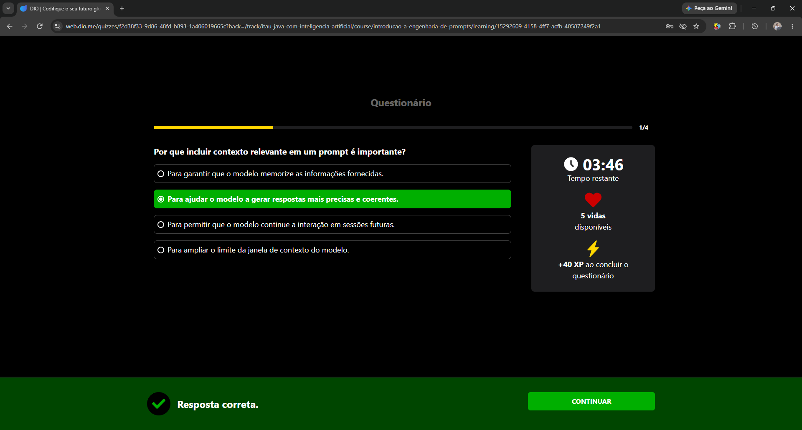
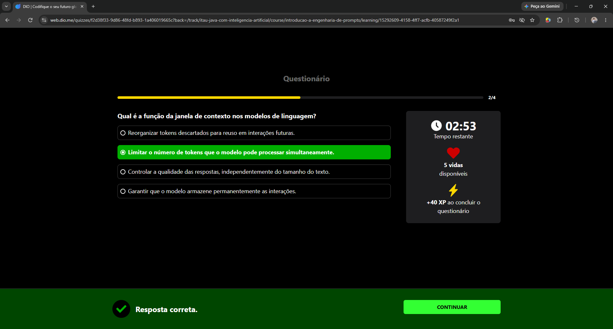
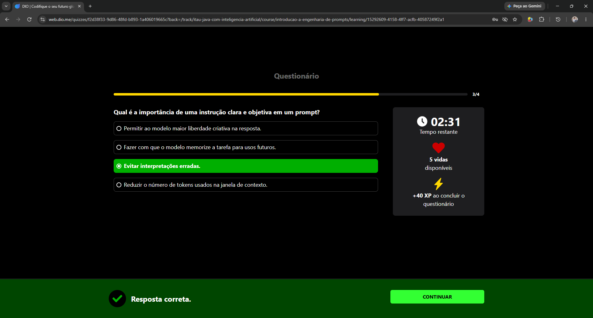
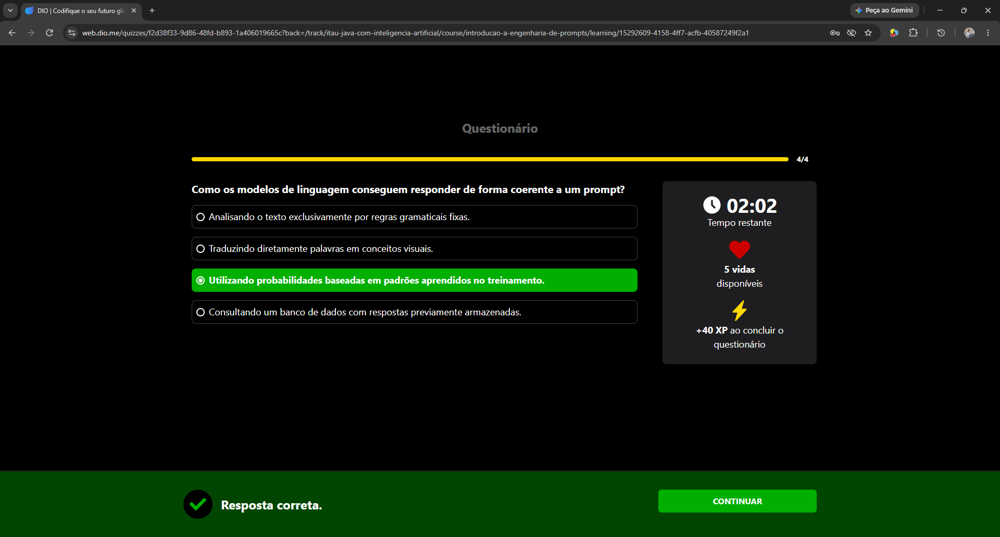
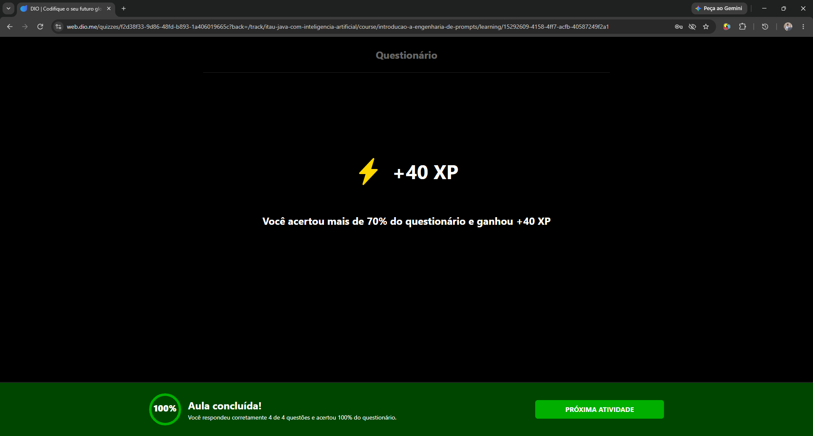

# Questionário Prático - Módulo 2

Neste desafio, avaliei meu entendimento sobre os fundamentos da Engenharia de Prompts (tokens, janela de contexto e os elementos essenciais de um bom prompt) através do questionário oficial do curso.

Abaixo estão documentadas as questões, as respostas corretas e minhas justificativas para fixação do conteúdo.

---

### Questão 1 (1/4)
**Pergunta:** Por que incluir contexto relevante em um prompt é importante?

**Minha Resposta (Correta):** Para ajudar o modelo a gerar respostas mais precisas e coerentes.

> **Justificativa:** Quando a gente dá mais contexto sobre o que precisa, a inteligência artificial não fica perdida a adivinhar as coisas. Fica muito mais fácil para ela focar no que interessa e entregar exatamente aquilo que foi pedido, em vez de inventar uma resposta genérica ou sem sentido.

  <em>Print da Questão 1</em> 
  
   
  Fonte: Autoral (2026)

---

### Questão 2 (2/4)
**Pergunta:** Qual é a função da janela de contexto nos modelos de linguagem?

**Minha Resposta (Correta):** Limitar o número de tokens que o modelo pode processar simultaneamente.

> **Justificativa:** A janela de contexto funciona basicamente como a capacidade da memória de curto prazo do modelo naquela conversa. Ela define um limite de texto (tokens) que ele consegue ler e processar de uma só vez, e se passarmos desse limite, ele simplesmente começa a esquecer o início da conversa.

  <em>Print da Questão 2</em> 
  
   
  Fonte: Autoral (2026)

---

### Questão 3 (3/4)
**Pergunta:** Qual é a importância de uma instrução clara e objetiva em um prompt?

**Minha Resposta (Correta):** Evitar interpretações erradas.

> **Justificativa:** Se o pedido for muito confuso ou aberto, o modelo pode interpretar de um jeito totalmente diferente do que imaginávamos e devolver algo nada a ver. Sendo direto ao ponto, garantimos que ele entenda o comando certo e não desvie do objetivo.

  <em>Print da Questão 3</em> 
  
   
  Fonte: Autoral (2026)

---

### Questão 4 (4/4)
**Pergunta:** Como os modelos de linguagem conseguem responder de forma coerente a um prompt?

**Minha Resposta (Correta):** Utilizando probabilidades baseadas em padrões aprendidos no treinamento.

> **Justificativa:** O modelo não pensa como uma pessoa e nem fica a pesquisar numa base de dados fixa na hora. Na verdade, ele analisou uma quantidade enorme de textos durante o treino e aprendeu quais palavras costumam vir depois das outras, calculando as probabilidades para montar uma frase que faça sentido.

  <em>Print da Questão 4</em> 
  
   
  Fonte: Autoral (2026)

---

## Resultado Final
Concluí o questionário avaliativo com sucesso, consolidando toda a base teórica sobre o funcionamento e o processamento de prompts estudados neste módulo!

  <em>Resultado do Questionário</em> 
  
   
  Fonte: Autoral (2026)

